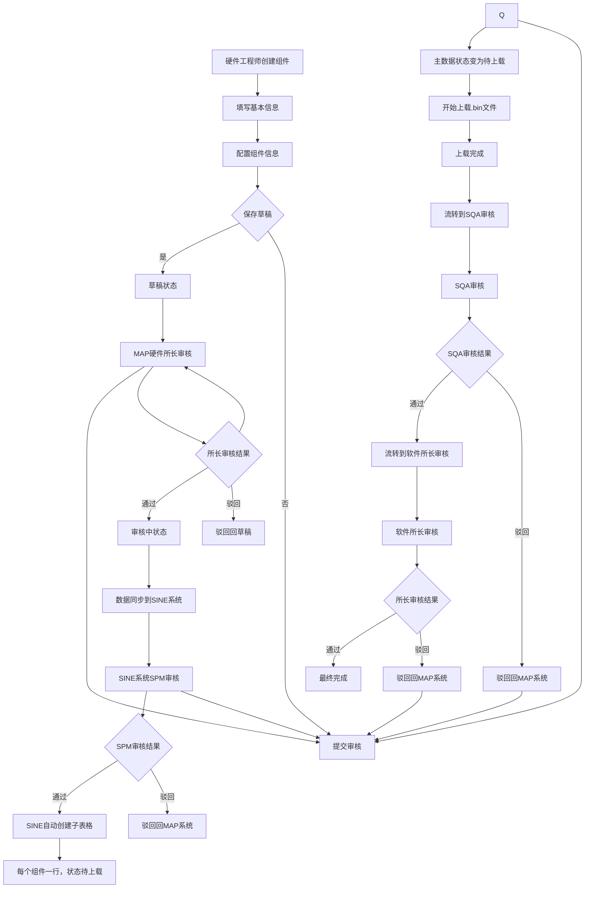

# MAP制造系统组件软件上载及发布功能 PRD

## 1. 项目概述

### 1.1 功能背景
MAP制造系统作为独立的生产管理系统，需要支持硬件工程师对固件组件进行统一的上载、审核和发布管理。该功能确保组件软件的规范管理，提高生产效率和数据安全性。

### 1.2 功能价值
- **规范化管理**：建立标准的组件软件管理流程
- **质量控制**：通过审核机制确保组件软件的可靠性
- **可追溯性**：完整的操作记录和版本管理
- **效率提升**：简化组件软件的发布流程

### 1.3 适用范围
- **目标用户**：硬件工程师、硬件所长
- **组件类型**：固件文件(.bin格式)
- **管理范围**：组件软件的上载、审核、发布、版本管理

## 2. 用户角色与权限

### 2.1 角色定义

| 角色 | 职责描述 | 权限范围 |
|------|----------|----------|
| 硬件工程师 | 组件软件的创建和编辑 | 上载、编辑(草稿状态、驳回状态)、查看、下载 |
| 硬件所长 | 组件软件的审核和管理 | 上载、编辑、删除、审核、查看、下载 |

### 2.2 权限矩阵

| 操作 | 硬件工程师 | 硬件所长 |
|------|------------|----------|
| 新建组件软件 | ✅ | ✅ |
| 编辑组件软件(草稿) | ✅ | ✅ |
| 编辑组件软件(已发布) | ❌ | ✅ |
| 编辑组件软件(驳回) | ✅ | ✅ |
| 删除组件软件 | ❌ | ✅ |
| 提交审核 | ✅ | ✅ |
| 审核通过/驳回 | ❌ | ✅ |
| 查看组件软件 | ✅ | ✅ |
| 查看操作记录 | ✅ | ✅ |

## 3. 业务流程

### 3.1 主要流程图



### 3.2 状态管理

| 状态 | 描述 | 可执行操作 | 状态转换 |
|------|------|------------|----------|
| 草稿 | 编辑中的组件软件 | 编辑、提交审核、删除 | →审核中 |
| 审核中 | 包含所有审核阶段 - MAP审核、SINE审核（SPM、SQA、所长） | 查看 | →待上载、→草稿 |
| 待上载 | SPM审核通过，等待上载 | 查看、上载 | →审核中 |
| 已完成 | 所长审核通过，流程结束 | 查看 | 无 |

**状态说明**：
- **审核中**：包含所有审核阶段 - MAP系统硬件所长审核、SINE系统审核（SPM、SQA、软件所长），通过操作记录区分具体阶段
- **待上载**：SPM审核通过，SINE已创建子表格，等待MAP系统执行上载
- **驳回规则**：任何环节审核驳回都驳回到上一个状态，保留已通过的审核结果

**驳回状态流转**：
- MAP硬件所长审核驳回：审核中 → 草稿
- SPM审核驳回：审核中 → 审核中（回到MAP所长审核阶段）
- SQA审核驳回：审核中 → 待上载
- 软件所长审核驳回：审核中 → 审核中（回到SQA审核阶段）

**注意**：MAP系统内部审核和SINE系统审核都统一显示为"审核中"状态，用户可通过操作记录查看具体审核阶段。

## 4. 功能详细设计

### 4.1 组件软件创建/编辑页面

#### 4.1.1 页面布局
```
┌─────────────────────────────────────────────────────┐
│ 组件软件管理 - [新建/编辑]                          │
├─────────────────────────────────────────────────────┤
│ 基本信息                                           │
│ ┌─────────────┐                                   │
│ │ BOM号       │                                   │
│ └─────────────┘                                   │
│ ┌─────────────┐                                   │
│ │ 客户 [下拉选择]                                 │
│ └─────────────┘                                   │
├─────────────────────────────────────────────────────┤
│ 组件配置                                           │
│ ┌─────┐ ┌─────────────┐                           │
│ │☐ PD │ │ PD位号输入框 │                           │
│ └─────┘ └─────────────┘                           │
│ ┌─────┐ ┌─────────────┐                           │
│ │☐ HUB1│ │ HUB1位号输入框│                           │
│ └─────┘ └─────────────┘                           │
│ ┌─────┐ ┌─────────────┐                           │
│ │☐ HUB2│ │ HUB2位号输入框│                           │
│ └─────┘ └─────────────┘                           │
├─────────────────────────────────────────────────────┤
│ 操作按钮                                           │
│ [保存草稿] [提交审核] [取消]                        │
└─────────────────────────────────────────────────────┘
```

**说明**：
- 文件上传不在MAP系统页面中进行
- 组件配置使用复选框选择组件类型，对应位号输入框
- BOM号输入后自动校验，无需手动点击校验按钮

#### 4.1.2 表单字段定义

| 字段名称 | 字段类型 | 是否必填 | 校验规则 | 说明 |
|----------|----------|----------|----------|------|
| BOM号 | 文本输入 | 是 | 1. 必填<br>2. 输入后自动调用SAP接口校验存在性<br>3. 校验失败提示"BOM不合法" | 输入后自动校验，实时反馈结果 |
| 客户 | 下拉选择 | 是 | 从预定义列表选择 | 数据来源参考MNT小板组件 |
| PD组件 | 复选框 | 否 | 勾选时需填写PD位号 | 选择是否包含PD组件 |
| PD位号 | 文本输入 | 条件必填 | 勾选PD组件时必填，字母+数字，最大20字符 | PD组件的位号信息 |
| HUB1组件 | 复选框 | 否 | 勾选时需填写HUB1位号 | 选择是否包含HUB1组件 |
| HUB1位号 | 文本输入 | 条件必填 | 勾选HUB1组件时必填，字母+数字，最大20字符 | HUB1组件的位号信息 |
| HUB2组件 | 复选框 | 否 | 勾选时需填写HUB2位号 | 选择是否包含HUB2组件 |
| HUB2位号 | 文本输入 | 条件必填 | 勾选HUB2组件时必填，字母+数字，最大20字符 | HUB2组件的位号信息 |

#### 4.1.4 编辑功能页面

**编辑页面要求**：
- **页面布局**：与新建页面完全相同
- **数据回填**：自动填充现有数据
- **功能完整**：所有新建页面的功能在编辑页面都可用

#### 4.1.5 审核功能页面

**审核页面布局**：
```
┌─────────────────────────────────────────────────────┐
│ 组件软件审核                                        │
├─────────────────────────────────────────────────────┤
│ 基本信息                                           │
│ ┌─────────────┐ ┌─────────────┐             │
│ │ BOM号       │ │ 客户         │             │
│ │ [只读显示]  │ │ [只读显示]    │             │
│ └─────────────┘ └─────────────┘             │
├─────────────────────────────────────────────────────┤
│ 组件配置                                           │
│ ┌─────┐ ┌─────────────┐                           │
│ │ PD  │ ☐ │ 位号       │                           │
│     │     │ [只读显示]  │                           │
│ └─────┘ └─────────────┘                           │
│ (类似HUB1、HUB2布局，所有字段只读，每个组件一行)                    │
├─────────────────────────────────────────────────────┤
│ 审核意见（必填）                                   │
│ ┌─────────────────────────────────────────────────┐   │
│ │                                         │   │
│ └─────────────────────────────────────────────────┘   │
├─────────────────────────────────────────────────────┤
│ [同意] [驳回] [取消]                              │
└─────────────────────────────────────────────────────┘
```

**审核功能要求**：
1. **页面模式**：所有表单字段为只读模式，不可编辑
2. **审核意见**：
   - 文本框必填，不能为空
   - 支持多行文本输入
   - 最大字符数限制：500字符
3. **快捷按钮**：
   - 点击"同意"按钮，审核意见文本框自动填入"同意"
   - 点击"驳回"按钮，需要手动填写驳回原因
4. **提交验证**：
   - 审核意见为空时，提示"审核意见不能为空"
   - 驳回时必须填写具体驳回原因

#### 4.1.6 交互逻辑

1. **BOM号自动校验**
   - 用户输入BOM号后，系统自动调用SAP接口校验
   - 校验通过：在输入框右侧显示绿色✅图标
   - 校验失败：在输入框右侧显示红色❌图标，并提示"BOM不合法"
   - 无需手动点击校验按钮，输入完成后自动触发校验

2. **组件勾选机制**
   - 默认所有组件复选框未勾选，对应位号输入框禁用
   - 勾选PD组件复选框后，PD位号输入框解除禁用
   - 勾选HUB1组件复选框后，HUB1位号输入框解除禁用
   - 勾选HUB2组件复选框后，HUB2位号输入框解除禁用
   - 每个组件独立占一行，布局更清晰
   - 组件复选框和位号输入框必须同时填写或同时为空

3. **重复BOM检测**
   - 提交时检查是否已存在相同BOM的已发布数据
   - 如存在，弹出确认框："已有数据，添加后原数据将弃用，是否继续？"

4. **文件管理说明**
   - 文件上传不在MAP系统页面中进行
   - 文件管理在其他模块处理，MAP系统仅管理组件配置信息

### 4.2 组件软件列表页面

#### 4.2.1 页面布局
```
┌─────────────────────────────────────────────────────┐
│ 组件软件管理                                         │
├─────────────────────────────────────────────────────┤
│ 筛选条件                                           │
│ ┌─────────────┐ ┌─────────────┐ ┌─────────────┐     │
│ │ BOM号搜索   │ │ 状态筛选    │ │ [查询]按钮  │     │
│ └─────────────┘ └─────────────┘ └─────────────┘     │
├─────────────────────────────────────────────────────┤
│ 操作按钮                                           │
│ [新建组件] [批量删除] [导出]                        │
├─────────────────────────────────────────────────────┤
│ 数据列表                                           │
│ ┌─────┬─────┬─────┬─────┬─────┬─────┬─────────┐         │
│ │BOM号 │客户 │创建人│创建时间│当前节点│状态 │操作     │         │
│ ├─────┼─────┼─────┼─────┼─────┼─────┼─────────┤         │
│ │数据1│客户A│张三 │2024-01-01│MAP硬件所长审核│已发布│[查看][下载]│         │
│ │数据2│客户B│李四 │2024-01-02│草稿状态     │草稿 │[编辑][删除]│         │
│ └─────┴─────┴─────┴─────┴─────┴─────────┘         │
├─────────────────────────────────────────────────────┤
│ 分页控制                                           │
│ [上一页] 1 2 3 ... [下一页]                        │
└─────────────────────────────────────────────────────┘
```

#### 4.2.1.1 组件子表布局
```
┌─────────────────────────────────────────────────────────────────────────────────────────────────────────────────────────────┐
│ 组件子表                                                                                                                │
├─────────┬───────┬──────────────┬──────────────┬───────────┬───────────────────┬───────────┬───────────────┬─────────────────┤
│ 类型    │ 位号  │ 软件版本号   │ 软件包       │ 文件大小  │ 上传时间          │ 创建人    │ 状态          │ 操作          │
├─────────┼───────┼──────────────┼──────────────┼───────────┼───────────────────┼───────────┼───────────────┼─────────────────┤
│ PD      │ TU1   │ PD SW A1     │ PD SW A1.bin │ 10K       │ 2026-02-11 10:15:10│ 李启超    │ 已审核        │ [下载][编辑][删除] │
│ HUB1    │ UU1   │ HUB1 SW A1   │ HUB1 SW A1.bin│ 15K       │ 2026-02-11 10:16:10│ 李启超    │ 已审核        │ [下载][编辑][删除] │
│ HUB2    │ UU2   │ HUB2 SW A1   │ HUB2 SW A1.bin│ 15K       │ 2026-02-11 10:16:20│ 李启超    │ 已审核        │ [下载][编辑][删除] │
│ MCU-NUC1261 │ NU1 │ MCU SW A1    │ MCU SW A1.bin│ 1M        │ 2026-02-11 10:17:00│ 李启超    │ 已审核        │ [下载][编辑][删除] │
└─────────┴───────┴──────────────┴──────────────┴───────────┴───────────────────┴───────────┴───────────────┴─────────────────┘
```

#### 4.2.2 列表字段定义

| 字段名 | 显示内容 | 说明 |
|--------|----------|------|
| BOM号 | BOM编号 | 支持点击查看详情 |
| 客户 | 客户名称 | 从下拉选择中获取 |
| 创建人 | 创建者姓名 | 显示用户真实姓名 |
| 创建时间 | 创建日期时间 | 格式：YYYY-MM-DD HH:mm:ss |
| 当前节点 | 当前审核环节 | 显示当前审核阶段和审核人 |
| 状态 | 当前状态 | 草稿/审核中/待上载/已完成 |
| 操作 | 操作按钮 | 根据状态和权限显示不同按钮 |

#### 4.2.2.1 组件子表字段定义

| 字段名 | 显示内容 | 说明 |
|--------|----------|------|
| 类型 | 组件类型 | PD、HUB1、HUB2、MCU-NUC1261等组件类型 |
| 位号 | 组件位号 | 组件在主板上的位置编号，如TU1、UU1、UU2、NU1 |
| 软件版本号 | 软件版本标识 | 格式如PD SW A1、HUB1 SW A1等 |
| 软件包 | 软件文件名 | 显示.bin文件名，支持点击下载 |
| 文件大小 | 文件大小 | 显示文件大小，如10K、15K、1M等 |
| 上传时间 | 上传日期时间 | 格式：YYYY-MM-DD HH:mm:ss |
| 创建人 | 上传者姓名 | 显示上传文件的用户真实姓名 |
| 状态 | 组件状态 | 待上载/已审核/已完成等状态 |
| 操作 | 操作按钮 | 包含下载、编辑、删除等操作按钮，根据状态和权限显示 |

#### 4.2.3 状态筛选

| 状态选项 | 默认选中 | 说明 |
|----------|----------|------|
| 草稿 | ✅ | 显示草稿状态数据 |
| 审核中 | ✅ | 显示审核中状态数据（包含MAP硬件所长审核和SINE系统审核） |
| 待上载 | ✅ | 显示待上载状态数据 |
| 已完成 | ✅ | 显示已完成状态数据 |

**状态查询支持多选**：用户可同时选择多个状态进行筛选

#### 4.2.4 操作按钮显示规则

操作列根据状态和权限动态显示不同按钮：

| 状态 | 硬件工程师操作 | 硬件所长操作 |
|------|---------------|-------------|
| 草稿 | [编辑][删除][提交审核] | [编辑][删除][提交审核] |
| 审核中 | [查看] | [审核][查看] |
| 审核中 | [查看] | [查看] |
| 待上载 | [查看] | [查看] |
| 已完成 | [查看] | [查看] |

**说明**：
- **待上载状态**：MAP系统仅提供查看功能，上载操作在SINE系统中进行
- **上载权限**：MAP系统不提供上载操作，所有上载功能都在SINE系统完成
- **系统分工**：MAP系统负责配置管理，SINE系统负责文件上载和审核

**特殊说明**：
- **审核中状态**：包含两个阶段
  - 第一阶段：MAP系统内部硬件所长审核（所长可审核操作）
  - 第二阶段：SINE系统审核（SPM→SQA→软件所长，仅查看）
- **系统分工**：MAP系统负责配置管理，SINE系统负责文件上载和审核
- **驳回处理**：驳回后回到上一个状态，可继续从该状态重新提交

### 4.3 跨系统审核流程

#### 4.3.1 MAP系统到SINE系统数据同步

**数据同步时机**：MAP系统硬件所长审核通过后，状态变为"审核中"，自动同步数据到SINE系统

**同步数据内容**：
- BOM号、客户信息
- 组件配置（PD、HUB1、HUB2组件和位号）
- 创建人、创建时间

#### 4.3.2 SINE系统审核流程

**SINE系统审核流程**：

1. **SPM审核阶段**：
   - SPM收到MAP系统同步的数据
   - 创建子表格，每个组件（PD、HUB1、HUB2）一行记录
   - 子表格初始状态为"待上载"
   - SPM审核通过后，状态变为"待上载"，MAP系统仅提供查看功能

2. **SPM编辑功能**：
   - **编辑权限**：已完成状态的子表格数据，SPM可以进行编辑
   - **编辑内容**：版本号、软件文件等
   - **版本管理**：提交后版本号自动增加1（如V1.0→V2.0）
   - **状态重置**：编辑后的数据状态重置为"待上载"，重新流程到SQA审核
   - **其他数据**：未修改的子数据状态保持不变
   - **操作日志**：每次编辑操作都要记录操作日志，包含修改前后的数据对比
   - **审核日志**：重新提交审核时记录审核日志，包含审核人和审核意见

3. **组件上载阶段**：
   - **上载权限**：SPM可进行组件软件上载
   - **上载内容**：
     - 版本号（必填）
     - 上传文件（必填，.bin格式）
     - 文件大小限制：50MB
   - **上载规则**：
     - 每个组件都需要单独上载
     - 所有组件上载完成后，才能提交到SQA审核
     - 填写完整后点击"提交审核"

3. **SQA审核阶段**：
   - 收到SPM提交的审核请求
   - 审核组件配置和上传文件
   - 审核通过：流转到软件所长审核
   - 审核驳回：回到待上载状态

4. **软件所长审核阶段**：
   - 最终审核确认
   - 审核通过：流程完成
   - 审核驳回：回到SQA审核阶段

**子表格状态流转**：
```
待上载 → 上载中 → 已上载 → SQA审核中 → 所长审核中 → 已完成
   ↑         ↓        ↓         ↓          ↓         ↓
   └─── 驳回 ──┴── 驳回 ──┴── 驳回 ──┴── 驳回 ──┴── 完成
```

**上载页面布局**：
```
┌─────────────────────────────────────────────────────┐
│ 组件软件上载                                        │
├─────────────────────────────────────────────────────┤
│ 组件选择                                           │
│ ┌─────────────┐ ┌─────────────┐             │
│ │ 组件选择   │ │ 位号显示   │             │
│ │ [下拉选择] │ │ [只读显示] │             │
│ └─────────────┘ └─────────────┘             │
├─────────────────────────────────────────────────────┤
│ 上载信息                                           │
│ ┌─────────────┐                                     │
│ │ 版本号     │                                     │
│ │ [输入框]   │                                     │
│ └─────────────┘                                     │
│ ┌─────────────┐                                     │
│ │ 软件上传   │                                     │
│ │ [选择文件] │                                     │
│ └─────────────┘                                     │
├─────────────────────────────────────────────────────┤
│ [提交审核] (所有信息填写完成后启用)                   │
└─────────────────────────────────────────────────────┘
```

**上载功能要求**：
- **组件选择**：下拉选择要上载的组件（PD、HUB1、HUB2等）
- **位号显示**：选择组件后自动显示对应的位号（只读）
- **版本号**：必填，手动输入版本号，格式V1.0、V2.0等
- **文件上传**：选择对应的.bin文件，支持.bin格式，最大50MB
- **上载操作**：点击上载按钮完成单个组件的上载
- **提交审核**：所有组件上载完成后才能提交审核
- **状态更新**：上载后自动更新组件状态为"已上载"

#### 4.3.3 驳回处理机制

**驳回场景及状态流转**：
- **MAP硬件所长审核驳回**：审核中 → 草稿
- **SPM审核驳回**：审核中 → 审核中（回到MAP所长审核阶段）
- **SQA审核驳回**：审核中 → 待上载
- **软件所长审核驳回**：审核中 → 审核中（回到SQA审核阶段）

**驳回处理**：
- MAP系统内部驳回：直接回到上一个状态
- SINE系统驳回：将驳回信息同步回MAP系统，回到上一个状态
- 驳回原因显示在操作记录中
- 用户可从驳回状态继续重新提交审核
- 所有驳回都遵循回到上一个状态的原则，保留已通过的审核结果

#### 4.3.4 状态同步机制

| MAP系统状态 | SINE系统状态 | 说明 |
|-------------|--------------|------|
| 审核中 | 无 | MAP系统内部硬件所长审核 |
| 审核中 | SPM审核中 → SQA审核中 → 所长审核中 | MAP所长审核通过后，按顺序在SINE系统审核 |
| 待上载 | 子表格创建完成 | SPM审核通过，等待上载 |
| 已完成 | 流程完成 | 所长审核通过，流程结束 |

**注意**：
1. MAP系统的"审核中"状态对应两个不同阶段，通过操作记录可以区分具体是在MAP内部审核还是SINE系统审核
2. 驳回时回到上一个状态，保留已通过的审核结果，避免重复审核

### 4.4 版本管理

#### 4.4.1 版本规则
- **版本编号**：V1.0, V2.0, V3.0... 格式
- **版本生成**：每次编辑后自动生成新版本
- **版本保留**：历史版本不能删除，永久保留
- **版本查询**：支持查看所有历史版本

#### 4.4.2 版本状态转换
```
新创建 → V1.0(草稿) → 提交审核 → V1.0(已发布) → 编辑 → V2.0(草稿)
```

#### 4.4.3 弃用机制
- 新版本审核通过后，旧版本自动变为"弃用"状态
- 弃用版本仍可查看和下载
- 弃用版本不能编辑或删除
- **弃用版本不能重新激活**
- 弃用版本通过状态标记进行标识

### 4.5 操作记录管理

#### 4.5.1 记录内容
每次操作记录以下信息：
- **操作时间**：精确到秒
- **操作人**：用户姓名和工号
- **操作类型**：创建、编辑、删除、审核通过、审核驳回、撤回
- **操作内容**：具体的操作描述
- **数据变化**：操作前后的数据对比（JSON格式）
- **IP地址**：操作来源IP
- **操作结果**：成功/失败

#### 4.5.2 记录查看
- **查看权限**：所有用户均可查看操作记录
- **查看方式**：在组件详情页面显示操作历史
- **记录展示**：按时间倒序排列，显示每次变更的具体内容
- **不支持查询和导出**：仅支持查看功能

#### 4.5.3 记录格式示例
```json
{
  "操作时间": "2024-04-02 14:30:25",
  "操作人": "张三(10001)",
  "操作类型": "编辑",
  "操作内容": "修改PD组件和位号",
  "数据变化": {
    "修改前": {
      "PD组件": "OLD_COMP",
      "PD位号": "OLD_POS"
    },
    "修改后": {
      "PD组件": "NEW_COMP", 
      "PD位号": "NEW_POS"
    }
  },
  "IP地址": "192.168.1.100",
  "操作结果": "成功"
}
```

## 5. 技术要求

### 5.1 性能要求
- **文件上传**：支持50MB文件上传，上传速度不低于1MB/s
- **页面响应**：页面加载时间不超过3秒
- **查询性能**：列表查询响应时间不超过2秒
- **并发支持**：支持50个用户同时操作

### 5.2 安全要求
- **文件安全**：上传文件需进行病毒扫描
- **权限控制**：严格的用户权限验证
- **数据加密**：敏感数据传输加密
- **操作审计**：完整的操作日志记录

### 5.3 集成要求
- **SAP集成**：BOM号校验接口
- **S3集成**：文件存储服务
- **用户系统**：用户身份认证
- **通知系统**：审核结果通知

## 6. 数据设计

### 6.1 主要数据表

#### 6.1.1 组件软件主表
```sql
CREATE TABLE component_software (
    id BIGINT PRIMARY KEY AUTO_INCREMENT,
    bom_code VARCHAR(50) NOT NULL COMMENT 'BOM号',
    customer_id VARCHAR(50) NOT NULL COMMENT '客户ID',
    creator_id VARCHAR(50) NOT NULL COMMENT '创建人ID',
    create_time DATETIME NOT NULL COMMENT '创建时间',
    status ENUM('draft', 'pending', 'rejected', 'pending_upload', 'published', 'deprecated') NOT NULL COMMENT '状态',
    version VARCHAR(10) NOT NULL COMMENT '版本号',
    file_name VARCHAR(255) COMMENT '文件名',
    file_path VARCHAR(500) COMMENT '文件路径',
    file_size BIGINT COMMENT '文件大小',
    pd_component VARCHAR(50) COMMENT 'PD组件',
    pd_position VARCHAR(20) COMMENT 'PD位号',
    hub1_component VARCHAR(50) COMMENT 'HUB1组件',
    hub1_position VARCHAR(20) COMMENT 'HUB1位号',
    hub2_component VARCHAR(50) COMMENT 'HUB2组件',
    hub2_position VARCHAR(20) COMMENT 'HUB2位号',
    INDEX idx_bom_code (bom_code),
    INDEX idx_status (status),
    INDEX idx_creator (creator_id)
);
```

#### 6.1.2 当前节点字段扩展
```sql
-- 在主表中添加当前节点字段
ALTER TABLE component_software 
ADD COLUMN current_node VARCHAR(100) COMMENT '当前审核节点和审核人',
ADD COLUMN current_auditor VARCHAR(50) COMMENT '当前审核人ID',
ADD COLUMN current_auditor_name VARCHAR(100) COMMENT '当前审核人姓名';
```
#### 6.1.3 SINE系统子表格
```sql
CREATE TABLE sine_component_sub_table (
    id BIGINT PRIMARY KEY AUTO_INCREMENT,
    main_component_id BIGINT NOT NULL COMMENT 'MAP主表ID',
    component_type VARCHAR(20) NOT NULL COMMENT '组件类型(PD/HUB1/HUB2)',
    component_name VARCHAR(50) COMMENT '组件名称',
    position_code VARCHAR(20) COMMENT '位号',
    status ENUM('pending_upload', 'uploaded', 'sqa_pending', 'director_pending', 'completed') NOT NULL COMMENT '状态',
    uploader_id VARCHAR(50) COMMENT '上传人ID',
    uploader_name VARCHAR(100) COMMENT '上传人姓名',
    upload_time DATETIME COMMENT '上传时间',
    file_name VARCHAR(255) COMMENT '文件名',
    file_path VARCHAR(500) COMMENT '文件路径',
    file_size BIGINT COMMENT '文件大小',
    create_time DATETIME NOT NULL COMMENT '创建时间',
    update_time DATETIME NOT NULL COMMENT '更新时间',
    INDEX idx_main_component (main_component_id),
    INDEX idx_status (status),
    INDEX idx_uploader (uploader_id)
);
```
#### 6.1.4 操作记录表
```sql
CREATE TABLE component_operation_log (
    id BIGINT PRIMARY KEY AUTO_INCREMENT,
    component_id BIGINT NOT NULL COMMENT '组件ID',
    operation_time DATETIME NOT NULL COMMENT '操作时间',
    operator_id VARCHAR(50) NOT NULL COMMENT '操作人ID',
    operation_type VARCHAR(20) NOT NULL COMMENT '操作类型',
    operation_content TEXT COMMENT '操作内容',
    data_before JSON COMMENT '修改前数据',
    data_after JSON COMMENT '修改后数据',
    ip_address VARCHAR(50) COMMENT 'IP地址',
    operation_result VARCHAR(10) NOT NULL COMMENT '操作结果',
    INDEX idx_component (component_id),
    INDEX idx_operator (operator_id),
    INDEX idx_time (operation_time)
);
```

### 6.2 数据字典

| 字典类型 | 字典值 | 说明 |
|----------|--------|------|
| 状态 | draft | 草稿 |
| 状态 | pending | 审核中 |
| 状态 | rejected | 驳回 |
| 状态 | pending_upload | 待上载 |
| 状态 | published | 已完成 |
| 状态 | deprecated | 弃用 |
| 操作类型 | create | 创建 |
| 操作类型 | edit | 编辑 |
| 操作类型 | delete | 删除 |
| 操作类型 | approve | 审核通过 |
| 操作类型 | reject | 审核驳回 |

## 7. 接口设计

### 7.1 SAP接口
- **BOM号校验接口**
  - 接口地址：`/api/sap/validate-bom`
  - 请求方式：POST
  - 请求参数：`{"bomCode": "XXXXX"}`
  - 返回结果：`{"valid": true/false, "message": "校验信息"}`

### 7.2 文件接口
- **文件上传接口**
  - 接口地址：`/api/file/upload`
  - 请求方式：POST
  - 请求参数：multipart/form-data
  - 返回结果：`{"success": true, "filePath": "s3://path", "fileName": "xxx.bin"}`

- **文件下载接口**
  - 接口地址：`/api/file/download/{id}`
  - 请求方式：GET
  - 返回：文件流

### 7.3 业务接口
- **组件软件CRUD接口**
- **审核接口**
- **版本查询接口**
- **操作记录查询接口**

## 8. 测试要求

### 8.1 功能测试
- **正向测试**：所有功能正常流程测试
- **异常测试**：错误处理和边界条件测试
- **权限测试**：不同角色权限验证
- **数据测试**：数据一致性和完整性测试

### 8.2 性能测试
- **文件上传性能**：不同大小文件上传测试
- **并发性能**：多用户同时操作测试
- **查询性能**：大数据量查询测试

### 8.3 安全测试
- **权限安全**：越权操作测试
- **文件安全**：恶意文件上传测试
- **数据安全**：敏感数据泄露测试

## 9. 验收标准

### 9.1 功能验收
- ✅ 所有功能按需求正常工作
- ✅ 用户界面友好，操作流畅
- ✅ 异常处理完善，用户提示清晰
- ✅ 权限控制严格，无越权风险

### 9.2 性能验收
- ✅ 页面响应时间≤3秒
- ✅ 文件上传速度≥1MB/s
- ✅ 支持50个并发用户
- ✅ 系统稳定运行24小时

### 9.3 质量验收
- ✅ 代码质量符合规范
- ✅ 测试覆盖率≥80%
- ✅ 无严重安全漏洞
- ✅ 文档完整准确

## 10. 待确认事项

### 10.1 记录管理
- ✅ 记录保存期限：建议3年
- ✅ 记录查看功能：在组件详情页面显示操作历史
- ✅ 记录查询功能：不支持查询和导出，仅支持查看

### 10.2 弃用数据处理
- ✅ 弃用数据查看：支持查看
- ✅ 弃用数据下载：支持下载
- ✅ 弃用数据标识：通过状态标记进行标识
- ✅ 弃用数据重新激活：不支持重新激活

### 10.3 审核流程
- ✅ 审核标准：已明确具体标准
- ✅ 审核意见：支持添加审核意见，默认为"同意"
- ✅ 审核通知：鼠标悬停显示审核意见

### 10.4 界面交互
- ✅ 操作按钮：根据状态动态显示
- ✅ 状态查询：支持多选
- ✅ 撤回功能：待审核状态可撤回
- ✅ 审核中编辑：审核中不能编辑

---

**文档版本**: 1.0  
**创建日期**: 2026-04-02  
**最后更新**: 2026-04-02  
**编写人员**: 系统分析师  
**审核人员**: [待填写]
