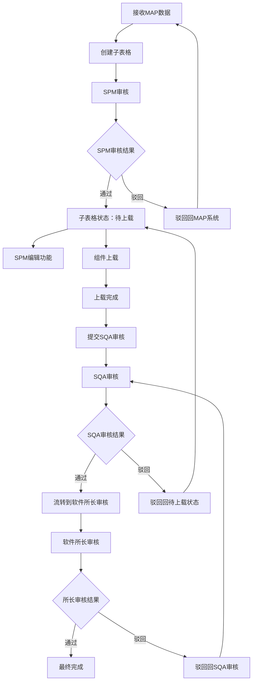

# SINE系统组件软件审核及上载功能 PRD

## 1. 项目概述

### 1.1 功能背景
SINE系统作为软件审核和发布的的核心系统，负责接收MAP系统同步的组件配置数据，管理组件软件的审核、上载和发布流程。该功能确保组件软件的规范管理和质量控制。

### 1.2 功能价值
- **审核管理**：建立标准的多级审核流程
- **版本控制**：完整的软件版本管理和追踪
- **质量保证**：通过多级审核确保软件可靠性
- **流程规范**：标准化的上载和发布流程

### 1.3 适用范围
- **目标用户**：SPM、SQA、软件所长
- **管理对象**：组件软件审核、上载、版本管理
- **核心职责**：接收MAP数据、审核流程、版本发布

## 2. 用户角色与权限

### 2.1 角色定义

| 角色 | 职责描述 | 权限范围 |
|------|----------|----------|
| SPM | 组件审核和子表格管理 | 审核、编辑子表格数据、提交审核 |
| SQA | 软件质量审核 | 审核、驳回、通过 |
| 软件所长 | 最终审核批准 | 最终审核、批准发布 |

### 2.2 权限矩阵

| 操作 | SPM | SQA | 软件所长 |
|------|------|------|----------|
| 查看组件信息 | ✅ | ✅ | ✅ |
| 编辑子表格数据 | ✅ | ❌ | ❌ |
| 审核通过/驳回 | ✅ | ✅ | ✅ |
| 提交审核 | ✅ | ❌ | ❌ |
| 下载文件 | ✅ | ✅ | ✅ |

## 3. 业务流程

### 3.1 主要流程图



### 3.2 状态管理

| 状态 | 描述 | 可执行操作 | 状态转换 |
|------|------|------------|----------|
| 待上载 | SPM审核通过，等待上载 | 查看、编辑、上载 | →审核中 |
| 审核中 | SQA审核中 | 查看 | →已完成、→待上载 |
| 所长审核中 | 软件所长审核中 | 查看 | →已完成、→审核中 |
| 已完成 | 流程完成 | 查看、下载 | 无 |

## 4. 功能详细设计

### 4.1 SPM审核功能

#### 4.1.1 审核页面布局
```
┌─────────────────────────────────────────────────────┐
│ SPM组件审核                                         │
├─────────────────────────────────────────────────────┤
│ 基本信息                                           │
│ ┌─────────────┐ ┌─────────────┐             │
│ │ BOM号       │ │ 客户         │             │
│ │ [只读显示]  │ │ [只读显示]    │             │
│ └─────────────┘ └─────────────┘             │
├─────────────────────────────────────────────────────┤
│ 组件配置                                           │
│ 组件：PD      位号：TU1                         │
│ 组件：HUB1     位号：UU1                         │
│ 组件：HUB2     位号：UU2                         │
│ (所有字段只读，每个组件一行)                          │
├─────────────────────────────────────────────────────┤
│ 审核意见（必填）                                   │
│ ┌─────────────────────────────────────────────────┐   │
│ │                                         │   │
│ └─────────────────────────────────────────────────┘   │
├─────────────────────────────────────────────────────┤
│ [同意] [驳回] [取消]                              │
└─────────────────────────────────────────────────────┘
```

#### 4.1.2 审核功能要求
1. **页面模式**：所有表单字段为只读模式，不可编辑
2. **审核意见**：
   - 文本框必填，不能为空
   - 支持多行文本输入
   - 最大字符数限制：500字符
3. **快捷按钮**：
   - 点击"同意"按钮，审核意见文本框自动填入"同意"
   - 点击"驳回"按钮，需要手动填写驳回原因
4. **提交验证**：
   - 审核意见为空时，提示"审核意见不能为空"
   - 驳回时必须填写具体驳回原因
5. **数据验证**：验证MAP系统同步的配置信息完整性
6. **同步机制**：审核通过后自动创建子表格

### 4.2 子表格管理

#### 4.2.1 组件子表布局
```
┌─────────────────────────────────────────────────────────────────────────────────────────────────────────────┐
│ 组件子表                                                                                                                │
├─────────┬───────┬──────────────┬──────────────┬───────────┬───────────────────┬───────────┬───────────────┬─────────────────┤
│ 类型    │ 位号  │ 软件版本号   │ 软件包       │ 文件大小  │ 上传时间          │ 创建人    │ 状态          │ 操作          │
├─────────┼───────┼──────────────┼──────────────┼───────────┼───────────────────┼───────────┼───────────────┼─────────────────┤
│ PD      │ TU1   │ PD SW A1     │ PD SW A1.bin │ 10K       │ 2026-02-11 10:15:10│ 李启超    │ 已审核        │ [下载][编辑][删除] │
│ HUB1    │ UU1   │ HUB1 SW A1   │ HUB1 SW A1.bin│ 15K       │ 2026-02-11 10:16:10│ 李启超    │ 已审核        │ [下载][编辑][删除] │
│ HUB2    │ UU2   │ HUB2 SW A1   │ HUB2 SW A1.bin│ 15K       │ 2026-02-11 10:16:20│ 李启超    │ 已审核        │ [下载][编辑][删除] │
│ MCU-NUC1261 │ NU1 │ MCU SW A1    │ MCU SW A1.bin│ 1M        │ 2026-02-11 10:17:00│ 李启超    │ 已审核        │ [下载][编辑][删除] │
└─────────┴───────┴──────────────┴──────────────┴───────────┴───────────────────┴───────────┴───────────────┴─────────────────┘
```

#### 4.2.2 组件子表字段定义

| 字段名 | 显示内容 | 说明 |
|--------|----------|------|
| 类型 | 组件类型 | PD、HUB1、HUB2、MCU-NUC1261等组件类型 |
| 位号 | 组件位号 | 组件在主板上的位置编号，如TU1、UU1、UU2、NU1 |
| 软件版本号 | 软件版本标识 | 格式如PD SW A1、HUB1 SW A1等 |
| 软件包 | 软件文件名 | 显示.bin文件名，支持点击下载 |
| 文件大小 | 文件大小 | 显示文件大小，如10K、15K、1M等 |
| 上传时间 | 上传日期时间 | 格式：YYYY-MM-DD HH:mm:ss |
| 创建人 | 上传者姓名 | 显示上传文件的用户真实姓名 |
| 状态 | 组件状态 | 待上载/已审核/已完成等状态 |
| 操作 | 操作按钮 | 包含下载、编辑、删除等操作按钮，根据状态和权限显示 |

#### 4.2.3 子表格操作权限

**操作权限规则**：
- **当前处理人=SPM**：可进行编辑、删除操作
- **当前处理人≠SPM**：仅可查看、下载操作
- **状态限制**：待上载/已审核状态可编辑，已完成状态不可编辑

**操作按钮显示规则**：
| 当前处理人 | 状态 | 可执行操作 |
|------------|------|----------|
| SPM | 待上载 | [编辑][删除][下载] |
| SPM | 已审核 | [编辑][删除][下载] |
| 其他用户 | 任何状态 | [查看][下载] |

**编辑功能**：
- 点击编辑按钮，弹出编辑表单
- 可修改版本号、重新上传文件
- 编辑后状态重置为"待上载"
- 需要重新走审核流程

**删除功能**：
- 点击删除按钮，弹出确认框
- 确认后删除该组件记录
- 删除后不可恢复，需谨慎操作

### 4.3 SPM编辑功能

#### 4.3.1 编辑功能描述
- **编辑权限**：已完成状态的子表格数据，SPM可以进行编辑
- **编辑内容**：版本号、软件文件等
- **版本管理**：提交后版本号自动增加1（如V1.0→V2.0）
- **状态重置**：编辑后的数据状态重置为"待上载"，重新流程到SQA审核
- **其他数据**：未修改的子数据状态保持不变
- **操作日志**：每次编辑操作都要记录操作日志，包含修改前后的数据对比
- **审核日志**：重新提交审核时记录审核日志，包含审核人和审核意见

### 4.4 组件上载功能

#### 4.4.1 上载页面布局
```
┌─────────────────────────────────────────────────────┐
│ 组件软件上载                                        │
├─────────────────────────────────────────────────────┤
│ 组件选择                                           │
│ ┌─────────────┐ ┌─────────────┐             │
│ │ 组件选择   │ │ 位号显示   │             │
│ │ [下拉选择] │ │ [只读显示] │             │
│ └─────────────┘ └─────────────┘             │
├─────────────────────────────────────────────────────┤
│ 上载信息                                           │
│ ┌─────────────┐                                     │
│ │ 版本号     │                                     │
│ │ [输入框]   │                                     │
│ └─────────────┘                                     │
│ ┌─────────────┐                                     │
│ │ 软件上传   │                                     │
│ │ [选择文件] │                                     │
│ └─────────────┘                                     │
├─────────────────────────────────────────────────────┤
│ [提交] (所有信息填写完成后启用)                   │
└─────────────────────────────────────────────────────┘
```

#### 4.4.2 上载功能要求
- **组件选择**：下拉选择要上载的组件（PD、HUB1、HUB2等）
- **位号显示**：选择组件后自动显示对应的位号（只读）
- **版本号**：必填，手动输入版本号，格式V1.0、V2.0等
- **文件上传**：选择对应的.bin文件，支持.bin格式，最大50MB
- **上载操作**：点击上载按钮完成单个组件的上载
- **提交**：所有组件上载完成后自动提交审核
- **状态更新**：上载后自动更新组件状态为"已上载"

### 4.5 SQA审核功能

#### 4.5.1 审核页面布局
```
┌─────────────────────────────────────────────────────┐
│ SQA组件审核                                         │
├─────────────────────────────────────────────────────┤
│ 基本信息                                           │
│ ┌─────────────┐ ┌─────────────┐             │
│ │ BOM号       │ │ 客户         │             │
│ │ [只读显示]  │ │ [只读显示]    │             │
│ └─────────────┘ └─────────────┘             │
├─────────────────────────────────────────────────────┤
│ 组件配置                                           │
│ 组件：PD      位号：TU1                         │
│ 组件：HUB1     位号：UU1                         │
│ 组件：HUB2     位号：UU2                         │
│ (所有字段只读，每个组件一行)                          │
├─────────────────────────────────────────────────────┤
│ 上载文件信息                                       │
│ PD组件：版本V1.0 文件：file1.bin 大小：10MB         │
│ HUB1组件：版本V1.0 文件：file2.bin 大小：15MB       │
│ HUB2组件：版本V1.0 文件：file3.bin 大小：12MB       │
├─────────────────────────────────────────────────────┤
│ 审核意见（必填）                                   │
│ ┌─────────────────────────────────────────────────┐   │
│ │                                         │   │
│ └─────────────────────────────────────────────────┘   │
├─────────────────────────────────────────────────────┤
│ [同意] [驳回] [取消]                              │
└─────────────────────────────────────────────────────┘
```

#### 4.5.2 审核功能要求
1. **页面模式**：所有表单字段为只读模式，不可编辑
2. **审核意见**：
   - 文本框必填，不能为空
   - 支持多行文本输入
   - 最大字符数限制：500字符
3. **快捷按钮**：
   - 点击"同意"按钮，审核意见文本框自动填入"同意"
   - 点击"驳回"按钮，需要手动填写驳回原因
4. **提交验证**：
   - 审核意见为空时，提示"审核意见不能为空"
   - 驳回时必须填写具体驳回原因
5. **审核内容**：
   - 组件配置：验证MAP系统同步的配置信息
   - 文件完整性：检查所有组件文件是否完整
   - 版本一致性：检查版本号格式和一致性
   - 文件格式：验证文件格式和大小

### 4.6 软件所长审核功能

#### 4.6.1 审核页面布局
```
┌─────────────────────────────────────────────────────┐
│ 软件所长最终审核                                     │
├─────────────────────────────────────────────────────┤
│ 基本信息                                           │
│ ┌─────────────┐ ┌─────────────┐             │
│ │ BOM号       │ │ 客户         │             │
│ │ [只读显示]  │ │ [只读显示]    │             │
│ └─────────────┘ └─────────────┘             │
├─────────────────────────────────────────────────────┤
│ 组件配置                                           │
│ 组件：PD      位号：TU1                         │
│ 组件：HUB1     位号：UU1                         │
│ 组件：HUB2     位号：UU2                         │
│ (所有字段只读，每个组件一行)                          │
├─────────────────────────────────────────────────────┤
│ 审核汇总信息                                       │
│ PD组件：版本V1.0 文件：file1.bin 大小：10MB 状态：SQA通过  │
│ HUB1组件：版本V1.0 文件：file2.bin 大小：15MB 状态：SQA通过  │
│ HUB2组件：版本V1.0 文件：file3.bin 大小：12MB 状态：SQA通过  │
├─────────────────────────────────────────────────────┤
│ 最终审核意见（必填）                                 │
│ ┌─────────────────────────────────────────────────┐   │
│ │                                         │   │
│ └─────────────────────────────────────────────────┘   │
├─────────────────────────────────────────────────────┤
│ [批准发布] [驳回] [要求修改]                      │
└─────────────────────────────────────────────────────┘
```

#### 4.6.2 审核功能要求
1. **页面模式**：所有表单字段为只读模式，不可编辑
2. **审核意见**：
   - 文本框必填，不能为空
   - 支持多行文本输入
   - 最大字符数限制：500字符
3. **快捷按钮**：
   - 点击"批准发布"按钮，审核意见文本框自动填入"批准发布"
   - 点击"驳回"按钮，驳回到SQA审核阶段
   - 点击"要求修改"按钮，要求特定修改后重新提交
4. **提交验证**：
   - 审核意见为空时，提示"审核意见不能为空"
   - 驳回时必须填写具体驳回原因
5. **审核权限**：
   - 批准发布：最终通过，组件软件正式发布
   - 驳回：驳回到上一个审核环节，需要修改
   - 要求修改：要求特定修改后重新提交

## 5. 驳回处理机制

### 5.1 驳回场景及状态流转
- **SPM审核驳回**：待上载 → 驳回状态，同步回MAP系统
- **SQA审核驳回**：审核中 → 待上载状态
- **软件所长审核驳回**：所长审核中 → SQA审核状态

### 5.2 驳回处理
- **驳回原因**：详细记录驳回原因和修改要求
- **状态同步**：驳回信息同步回MAP系统和相关子表格
- **重新提交**：用户可从驳回状态继续修改和提交

## 6. 版本管理

### 6.1 版本规则
- **版本编号**：V1.0, V2.0, V3.0... 格式
- **版本生成**：每次编辑后自动生成新版本
- **版本保留**：历史版本不能删除，永久保留
- **版本查询**：支持查看所有历史版本

### 6.2 版本状态转换
```
新创建 → V1.0(待上载) → 上载完成 → V1.0(已完成) → 编辑 → V2.0(待上载)
```

## 7. 操作记录管理

### 7.1 记录内容
每次操作记录以下信息：
- **操作时间**：精确到秒
- **操作人**：用户姓名和工号
- **操作类型**：创建、编辑、删除、审核通过、审核驳回、提交审核
- **操作内容**：具体的操作描述
- **数据变化**：操作前后的数据对比（JSON格式）
- **IP地址**：操作来源IP
- **操作结果**：成功/失败

### 7.2 记录查看
- **查看权限**：所有用户均可查看操作记录
- **查看方式**：在组件详情页面显示操作历史
- **记录展示**：按时间倒序排列，显示每次变更的具体内容

## 8. 技术要求

### 8.1 性能要求
- **文件上传**：支持50MB文件上传，上传速度不低于1MB/s
- **页面响应**：页面加载时间不超过3秒
- **查询性能**：列表查询响应时间不超过2秒
- **并发支持**：支持50个用户同时操作

### 8.2 安全要求
- **文件安全**：上传文件需进行病毒扫描
- **权限控制**：严格的用户权限验证
- **数据加密**：敏感数据传输加密
- **操作审计**：完整的操作日志记录

### 8.3 集成要求
- **MAP系统集成**：接收MAP系统同步数据
- **文件存储**：S3文件存储服务
- **用户系统**：用户身份认证
- **通知系统**：审核结果通知

## 9. 数据设计

### 9.1 主要数据表

#### 9.1.1 组件子表格
```sql
CREATE TABLE sine_component_sub_table (
    id BIGINT PRIMARY KEY AUTO_INCREMENT,
    main_component_id BIGINT NOT NULL COMMENT 'MAP主表ID',
    component_type VARCHAR(20) NOT NULL COMMENT '组件类型(PD/HUB1/HUB2)',
    component_name VARCHAR(50) COMMENT '组件名称',
    position_code VARCHAR(20) COMMENT '位号',
    status ENUM('pending_upload', 'uploaded', 'sqa_pending', 'director_pending', 'completed') NOT NULL COMMENT '状态',
    uploader_id VARCHAR(50) COMMENT '上传人ID',
    uploader_name VARCHAR(100) COMMENT '上传人姓名',
    upload_time DATETIME COMMENT '上传时间',
    file_name VARCHAR(255) COMMENT '文件名',
    file_path VARCHAR(500) COMMENT '文件路径',
    file_size BIGINT COMMENT '文件大小',
    version VARCHAR(10) COMMENT '版本号',
    create_time DATETIME NOT NULL COMMENT '创建时间',
    update_time DATETIME NOT NULL COMMENT '更新时间',
    INDEX idx_main_component (main_component_id),
    INDEX idx_status (status),
    INDEX idx_uploader (uploader_id)
);
```

#### 9.1.2 操作记录表
```sql
CREATE TABLE sine_operation_log (
    id BIGINT PRIMARY KEY AUTO_INCREMENT,
    component_id BIGINT NOT NULL COMMENT '组件ID',
    operation_time DATETIME NOT NULL COMMENT '操作时间',
    operator_id VARCHAR(50) NOT NULL COMMENT '操作人ID',
    operation_type VARCHAR(20) NOT NULL COMMENT '操作类型',
    operation_content TEXT COMMENT '操作内容',
    data_before JSON COMMENT '修改前数据',
    data_after JSON COMMENT '修改后数据',
    ip_address VARCHAR(50) COMMENT 'IP地址',
    operation_result VARCHAR(10) NOT NULL COMMENT '操作结果',
    INDEX idx_component (component_id),
    INDEX idx_operator (operator_id),
    INDEX idx_time (operation_time)
);
```

## 10. 接口设计

### 10.1 MAP系统接口
- **数据接收接口**：接收MAP系统同步的组件配置数据
- **状态同步接口**：向MAP系统同步审核状态和驳回信息

### 10.2 文件接口
- **文件上传接口**：处理.bin文件上传
- **文件下载接口**：提供文件下载功能

### 10.3 业务接口
- **组件审核接口**：SPM审核操作
- **版本管理接口**：版本创建和更新
- **操作记录查询接口**：操作历史查询

## 11. 测试要求

### 11.1 功能测试
- **正向测试**：所有功能正常流程测试
- **异常测试**：错误处理和边界条件测试
- **权限测试**：不同角色权限验证
- **数据测试**：数据一致性和完整性测试

### 11.2 性能测试
- **文件上传性能**：不同大小文件上传测试
- **并发性能**：多用户同时操作测试
- **查询性能**：大数据量查询测试

### 11.3 安全测试
- **权限安全**：越权操作测试
- **文件安全**：恶意文件上传测试
- **数据安全**：敏感数据泄露测试

## 12. 验收标准

### 12.1 功能验收
- ✅ 所有功能按需求正常工作
- ✅ 用户界面友好，操作流畅
- ✅ 异常处理完善，用户提示清晰
- ✅ 权限控制严格，无越权风险

### 12.2 性能验收
- ✅ 页面响应时间≤3秒
- ✅ 文件上传速度≥1MB/s
- ✅ 支持50个并发用户
- ✅ 系统稳定运行24小时

### 12.3 质量验收
- ✅ 代码质量符合规范
- ✅ 测试覆盖率≥80%
- ✅ 无严重安全漏洞
- ✅ 文档完整准确

---

**文档版本**: 1.0  
**创建日期**: 2026-04-02  
**最后更新**: 2026-04-02  
**编写人员**: 系统分析师  
**审核人员**: [待填写]
