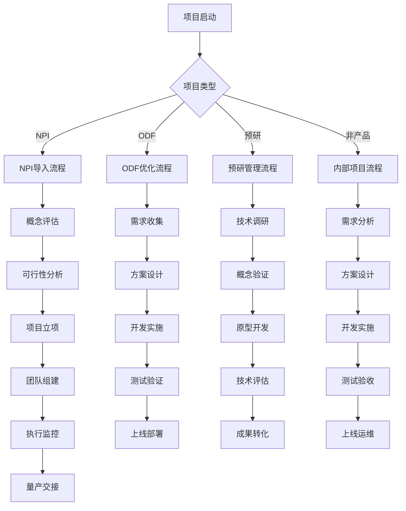

# NPI+ODF+预研项目管理模块 PRD

## 1. 项目概述

### 1.1 项目背景
随着公司产品线的不断扩展，新产品导入(NPI)、现有产品优化(ODF)和预研项目管理成为产品开发流程中的关键环节。当前缺乏统一的项目管理系统，导致：
- 项目进度跟踪不准确
- 资源分配效率低下
- 跨部门协作困难
- 项目数据分散，难以统计分析

### 1.2 项目价值
建立一套完整的项目管理平台，整合NPI、ODF和预研项目的全生命周期管理，提升：
- 项目执行效率
- 资源利用率
- 跨部门协作效率
- 决策数据支撑

### 1.3 适用范围
- **NPI项目**：新产品导入，从概念到量产的完整流程
- **ODF项目**：现有产品优化升级，包含功能改进和性能提升
- **预研项目**：技术预研和概念验证，不直接产生商业价值
- **非产品项目**：内部系统开发、流程优化等支持性项目

## 2. 业务流程图

## 3. 详细功能需求

### 3.1 项目立项管理

#### 3.1.1 前置条件
- 项目提案已通过初步评审
- 预算额度已确认
- 核心资源已预留
- 项目时间窗口已确定

#### 3.1.2 页面元素与交互
- **项目信息录入**
  - 项目名称、项目编号、项目类型
  - 项目经理、技术负责人、产品负责人
  - 预计开始时间、预计结束时间
  - 预算金额、实际成本跟踪
  - 项目描述、目标、成功标准
  
- **项目类型选择**
  - NPI项目：新产品导入
  - ODF项目：产品优化
  - 预研项目：技术预研
  - 非产品项目：内部系统开发
  
- **立项审批流程**
  - 部门主管审批
  - 财务预算审批
  - 技术可行性评估
  - 资源冲突检查

#### 3.1.3 表单校验规则
- 项目名称：必填，2-50字符
- 项目编号：自动生成，格式：{类型}{年份}{序号}
- 项目类型：必选，从预定义类型中选择
- 负责人：必填，从组织架构中选择
- 时间范围：开始时间不能晚于结束时间
- 预算金额：非负数，不超过部门预算额度

### 3.2 项目执行监控

#### 3.2.1 甘特图管理
- **项目时间轴**
  - 里程碑节点显示
  - 关键路径标识
  - 依赖关系可视化
  - 延期风险预警

- **任务分解结构**
  - 项目阶段划分（概念、设计、开发、测试、量产）
  - 任务包管理
  - 工作量估算
  - 责任人分配

#### 3.2.2 进度跟踪
- **进度填报**
  - 任务完成百分比
  - 实际工时记录
  - 问题和风险记录
  - 变更请求管理

- **进度可视化**
  - 项目健康度仪表板
  - 资源利用率图表
  - 成本执行趋势分析
  - 里程碑达成率统计

### 3.3 资源与成本管理

#### 3.3.1 人力资源分配
- **人员技能矩阵**
  - 技能要求与人员匹配
  - 工作负载均衡分析
  - 跨部门资源协调
  - 外部资源管理

- **资源日历管理**
  - 人员可用性查看
  - 资源冲突检测
  - 关键资源锁定
  - 替代方案规划

#### 3.3.2 成本控制
- **预算管理**
  - 成本科目分类（人工、设备、材料、外包）
  - 预算执行监控
  - 成本偏差分析
  - 超支预警机制

- **成本核算**
  - 实际成本归集
  - 成本分摊规则
  - 投资回报分析
  - 项目盈利评估

### 3.4 质量与风险管理

#### 3.4.1 质量控制点
- **NPI项目质量门禁**
  - 概念评审通过
  - 设计方案确认
  - 样品测试合格
  - 量产准备就绪
  
- **ODF项目质量标准**
  - 性能提升达标
  - 用户反馈满意度
  - 系统稳定性验证
  - 向后兼容性确认

- **预研项目评估标准**
  - 技术可行性验证
  - 创新价值评估
  - 可转化性分析
  - 知识产权保护

#### 3.4.2 风险识别与应对
- **技术风险**
  - 新技术不确定性
  - 技术集成复杂度
  - 性能达标风险
  - 供应链技术瓶颈

- **市场风险**
  - 市场接受度不确定
  - 竞争对手动态
  - 客户需求变化
  - 法规政策变化

- **资源风险**
  - 关键人员流失
  - 资源冲突
  - 预算超支可能
  - 外部依赖风险

### 3.5 项目收尾与知识管理

#### 3.5.1 项目验收标准
- **NPI项目验收**
  - 量产技术文件完整
  - 质量标准达标
  - 成本控制在预算内
  - 时间按计划完成

- **ODF项目验收**
  - 性能指标达成
  - 用户测试通过
  - 文档更新完整
  - 培训实施到位

- **预研项目验收**
  - 技术报告完整
  - 原型功能验证
  - 可行性结论明确
  - 后续转化路径清晰

#### 3.5.2 知识沉淀与复用
- **项目文档管理**
  - 项目计划文档
  - 技术方案文档
  - 测试报告文档
  - 项目总结文档

- **经验知识库**
  - 成功案例库
  - 失败教训库
  - 最佳实践库
  - 技术方案库

- **模板标准化**
  - 项目计划模板
  - 风险检查清单
  - 验收标准模板
  - 报告格式规范

## 4. 数据字典

### 4.1 项目基础信息
| 字段名 | 类型 | 长度 | 必填 | 默认值 | 说明 |
|--------|------|------|------|----------|------|
| project_id | 字符串 | 20 | 是 | 自动生成 | 项目唯一标识 |
| project_name | 字符串 | 100 | 是 | - | 项目名称 |
| project_type | 枚举 | 10 | 是 | NPI/ODF/预研/非产品 | 项目类型 |
| status | 枚举 | 10 | 是 | 规划/执行/暂停/完成/取消 | 项目状态 |
| manager_id | 字符串 | 20 | 是 | - | 项目经理ID |
| start_date | 日期 | - | 是 | - | 计划开始日期 |
| end_date | 日期 | - | 是 | - | 计划结束日期 |

### 4.2 资源信息
| 字段名 | 类型 | 长度 | 必填 | 默认值 | 说明 |
|--------|------|------|------|----------|------|
| resource_id | 字符串 | 20 | 是 | - | 资源唯一标识 |
| resource_name | 字符串 | 50 | 是 | - | 资源名称 |
| skill_type | 枚举 | 20 | 是 | 技术/管理/测试/其他 | 技能类型 |
| availability | 布尔 | - | 是 | true | 资源可用性 |
| cost_rate | 数值 | 10,2 | 是 | 0 | 成本费率 |

### 4.3 任务信息
| 字段名 | 类型 | 长度 | 必填 | 默认值 | 说明 |
|--------|------|------|------|----------|------|
| task_id | 字符串 | 20 | 是 | 自动生成 | 任务唯一标识 |
| task_name | 字符串 | 200 | 是 | - | 任务名称 |
| parent_task_id | 字符串 | 20 | 否 | - | 父任务ID |
| estimated_hours | 数值 | 8,2 | 是 | 0 | 预估工时 |
| actual_hours | 数值 | 8,2 | 否 | 0 | 实际工时 |
| completion_rate | 数值 | 5,2 | 否 | 0 | 完成百分比 |

## 5. 异常流程与边界情况

### 5.1 项目延期处理
- **延期预警机制**
  - 里程碑延期7天预警
  - 进度偏差超过20%告警
  - 关键路径延误自动升级
  
- **延期审批流程**
  - 延期原因分析
  - 影响评估
  - 调整方案制定
  - 相关方确认

### 5.2 资源冲突处理
- **冲突检测规则**
  - 同一时间段多项目分配
  - 关键技能资源过载
  - 外部依赖资源不可用
  
- **冲突解决策略**
  - 优先级排序
  - 资源重新分配
  - 外部资源协调
  - 项目时间调整

### 5.3 预算超支处理
- **超支监控**
  - 实时成本跟踪
  - 预算使用率80%预警
  - 超支自动冻结
  
- **超支审批**
  - 超支原因分析
  - 额外预算申请
  - 成本优化方案
  - 管理层审批

### 5.4 项目取消/暂停
- **暂停条件**
  - 关键资源不可用
  - 外部依赖失败
  - 重大技术障碍
  - 市场环境剧变
  
- **取消条件**
  - 技术不可行
  - 市场需求消失
  - 战略方向调整
  - 资源无法保障

## 6. 指标与统计需求

### 6.1 项目执行指标
- **时间指标**
  - 项目准时完成率
  - 里程碑达成率
  - 平均项目周期
  - 延期项目比例

- **成本指标**
  - 预算执行准确率
  - 成本控制偏差率
  - 投资回报率
  - 资源利用效率

- **质量指标**
  - 一次验收通过率
  - 返工比例
  - 质量事故次数
  - 客户满意度

### 6.2 资源效率指标
- **人力资源**
  - 人员利用率
  - 技能匹配度
  - 跨部门协作效率
  - 关键人才保留率

- **设备资源**
  - 设备利用率
  - 故障率
  - 维护成本
  - 投资回报率

### 6.3 决策支持指标
- **项目组合分析**
  - NPI/ODF/预研项目比例
  - 风险项目分布
  - 资源分配优化度
  - 战略目标达成率

- **趋势分析**
  - 项目周期趋势
  - 成本变化趋势
  - 质量改进趋势
  - 资源需求预测

## 7. 系统集成要求

### 7.1 内部系统集成
- **ERP系统对接**
  - 项目主数据同步
  - 成本数据归集
  - 人力资源信息
  - 财务数据接口

- **PLM系统集成**
  - 产品数据同步
  - BOM管理对接
  - 变更管理集成
  - 文档管理系统

### 7.2 外部协作
- **供应商门户**
  - 供应商项目协作
  - 进度信息共享
  - 质量问题反馈
  - 交付文档管理

- **客户协作平台**
  - 项目进度透明化
  - 需求变更管理
  - 验收标准确认
  - 知识库共享

## 8. 安全与权限要求

### 8.1 数据安全
- **项目数据保护**
  - 敏感信息加密
  - 访问日志记录
  - 数据备份机制
  - 灾难恢复方案

- **知识产权保护**
  - 技术方案权限控制
  - 文档版本管理
  - 外发内容审核
  - 保密协议管理

### 8.2 权限管理
- **角色权限矩阵**
  - 项目管理员：全权限
  - 项目经理：项目内全权限
  - 部门主管：本部门项目权限
  - 普通用户：只读权限

- **数据访问控制**
  - 按项目类型控制访问
  - 按部门维度控制访问
  - 按项目状态控制访问
  - 敏感信息分级访问

## 9. 验收标准

### 9.1 功能验收标准
- **基础功能完备性**
  - 项目立项流程完整可用
  - 执行监控功能正常
  - 资源管理功能达标
  - 报表统计功能准确

- **业务流程支持**
  - NPI/ODF/预研流程全覆盖
  - 异常处理机制完善
  - 审批流程可配置
  - 通知提醒及时准确

### 9.2 性能验收标准
- **系统性能**
  - 并发用户数支持：≥1000
  - 页面响应时间：≤3秒
  - 数据查询响应：≤2秒
  - 系统可用性：≥99.5%

- **数据处理能力**
  - 项目数据量：支持10万+项目
  - 并发操作：支持500+并发
  - 报表生成：≤30秒
  - 数据导入导出：≤1分钟

### 9.3 用户体验标准
- **界面友好性**
  - 操作流程直观易懂
  - 关键信息突出显示
  - 移动端适配良好
  - 无障碍访问支持

- **系统稳定性**
  - 数据一致性保证
  - 操作结果可预期
  - 异常提示清晰明确
  - 系统恢复时间≤4小时

---

**文档版本：v1.0**  
**创建日期：2026-03-13**  
**负责人：产品管理部**  
**下次评审日期：2026-03-20**
