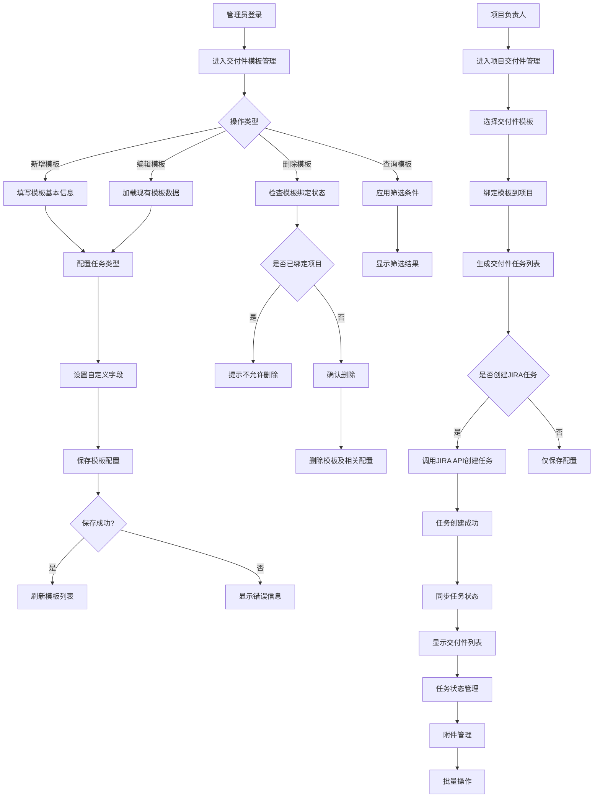

# 交付件模板管理模块 PRD

## 功能描述
建立一套完整的交付件模板管理系统，支持多种产品类型的交付件模板创建、配置、绑定和任务管理，实现从模板配置到项目交付件创建的全流程管理，解决当前交付件管理分散、配置复杂、流程不统一的问题。

## 优先级
P0 - 核心业务功能，3月份必须完成交付

## 输入条件/前置条件
- **系统权限**：用户需具备交付件模板管理权限
- **数据来源**：从JIRA获取项目信息、任务类型、自定义字段
- **基础配置**：产品类型、阶段、任务类型等基础数据已配置
- **环境要求**：JIRA系统连接正常，SRDPM接口可用

## 处理流程

### 1. 界面布局与交互

#### 1.1 交付件模板列表页面
- **页面区域划分**：
  - 顶部筛选区域：产品类型筛选、阶段筛选、搜索框
  - 中间数据列表区域：表格形式展示模板信息
  - 底部操作区域：新增模板按钮、批量操作按钮

- **关键控件和操作元素**：
  - 产品类型下拉选择：TV、JDM、FTV等
  - 阶段下拉选择：从SRDPM获取的阶段数据
  - 搜索框：支持模板名称模糊搜索
  - 新增模板按钮：弹出模板配置对话框
  - 操作列：编辑、删除按钮

- **界面设计特点**：
  - 表格采用简洁的卡片式设计
  - 启用状态用开关组件显示，绿色表示启用
  - 操作按钮采用图标+文字组合
  - 支持响应式布局，适配不同屏幕尺寸

#### 1.2 模板配置页面
- **页面区域划分**：
  - 基础信息区域：模板名称、产品类型选择
  - 任务配置区域：任务列表表格，支持增删改
  - 自定义字段区域：字段配置弹窗
  - 底部操作区域：保存、取消按钮

- **用户交互流程**：
  1. 点击"新增模板"进入配置页面
  2. 填写模板基本信息
  3. 配置任务类型和问题类型
  4. 设置自定义字段
  5. 保存模板配置

- **界面设计特点**：
  - 采用弹窗形式，避免页面跳转
  - 任务配置支持拖拽排序
  - 自定义字段配置采用侧边栏滑出
  - 表单验证实时反馈

#### 1.3 项目绑定页面
- **页面区域划分**：
  - 模板选择区域：下拉选择可用模板
  - 项目信息区域：显示项目基本信息
  - 交付件列表区域：显示模板生成的交付件任务
  - 操作区域：创建任务、清空绑定等

- **界面设计特点**：
  - 采用标签页形式，支持多项目管理
  - 交付件状态用不同底色区分（白色/蓝色/绿色）
  - 附件管理支持拖拽上传
  - 批量操作采用浮动工具栏

#### 1.4 自定义字段配置弹窗
- **页面区域划分**：
  - 字段选择区域：从JIRA获取的所有字段列表
  - 已选字段区域：当前模板选择的字段
  - 变量配置区域：支持变量替换的字段设置
  - 操作区域：确定、取消按钮

- **界面设计特点**：
  - 左右双栏布局，支持字段拖拽选择
  - 变量字段特殊标识，显示变量图标
  - 字段重复选择时给出提示
  - 支持字段搜索和筛选

### 2. 数据列表区域

#### 2.1 模板列表字段
| 字段名 | 类型 | 显示规则 | 数据来源 | 默认值 |
|--------|------|----------|----------|---------|
| 交付件模板 | 文本 | 显示模板名称 | 用户输入 | - |
| 产品类型 | 下拉 | 显示产品类型标签 | 系统配置 | TV |
| 启用状态 | 开关 | 启用显示绿色，禁用显示灰色 | 用户配置 | 启用 |
| 创建时间 | 日期 | YYYY-MM-DD格式 | 系统生成 | - |
| 操作 | 按钮组 | 编辑、删除按钮 | - | - |

#### 2.2 任务配置列表字段
| 字段名 | 类型 | 显示规则 | 数据来源 | 默认值 |
|--------|------|----------|----------|---------|
| 任务类型 | 下拉 | Epic/标准任务/子任务 | JIRA获取 | 标准任务 |
| 问题类型 | 下拉 | 根据任务类型动态变化 | JIRA获取 | 故事 |
| 交付件名称 | 文本 | 支持变量替换 | 用户输入 | - |
| 描述 | 文本 | 256字符限制 | 用户输入 | - |
| 启用状态 | 开关 | 启用/禁用 | 用户配置 | 启用 |
| 归档SRDPN | 复选框 | 是否同步到SRDPN | 用户配置 | 否 |

### 3. 操作功能

#### 3.1 新增模板
- **操作流程**：
  1. 点击"新增模板"按钮
  2. 弹出模板配置对话框
  3. 填写模板名称（必填，2-50字符）
  4. 选择产品类型（必选）
  5. 配置任务列表
  6. 设置自定义字段
  7. 点击保存

- **校验规则**：
  - 模板名称不能重复
  - 产品类型必须选择
  - 至少配置一个任务
  - 自定义字段不能重复选择

#### 3.2 编辑模板
- **操作流程**：
  1. 点击列表中的"编辑"按钮
  2. 弹出模板配置对话框，带出原有数据
  3. 修改各项配置
  4. 点击保存

- **限制条件**：
  - 模板名称不可修改（避免影响已绑定项目）
  - 产品类型不可修改（避免数据不一致）
  - 已绑定的模板删除任务需校验下级依赖

#### 3.3 删除模板
- **操作流程**：
  1. 点击"删除"按钮
  2. 弹出确认对话框
  3. 确认后删除模板及相关配置

- **校验机制**：
  - 检查是否已绑定项目
  - 已绑定的模板不允许删除
  - 删除标准任务时需同时删除下级子任务

#### 3.4 查询功能
- **查询条件**：
  - 产品类型筛选
  - 阶段筛选
  - 模板名称模糊搜索
  - 启用状态筛选

- **结果显示**：
  - 支持分页显示
  - 支持排序（按创建时间、模板名称）
  - 显示总记录数

#### 3.5 其他操作
- **批量操作**：批量启用/禁用模板
- **导入导出**：支持模板配置的导入导出
- **复制模板**：基于现有模板快速创建新模板

### 4. 业务逻辑

#### 4.1 核心业务规则
- **模板与项目关系**：一个项目只能绑定一个交付件模板
- **任务层级关系**：Epic → 标准任务 → 子任务的三级结构
- **变量替换规则**：创建任务时自动替换变量为实际项目数据
- **启用状态控制**：只有启用的任务才会创建到JIRA

#### 4.2 数据校验规则
- **模板名称唯一性**：同一产品类型下模板名称不能重复
- **任务依赖校验**：删除标准任务时需检查是否有子任务依赖
- **字段重复校验**：自定义字段每个只能选择一次
- **产品类型转换**：推送到SRDPN时JDM转换为TB

#### 4.3 权限控制逻辑
- **模板管理权限**：只有具备管理权限的用户才能操作
- **项目绑定权限**：项目负责人可绑定模板到项目
- **字段访问权限**：根据项目模板控制自定义字段显示

#### 4.4 状态流转规则
- **任务状态同步**：从JIRA同步任务状态到本地
- **状态颜色区分**：未开始(白色)、进行中(蓝色)、已完成(绿色)、失败(红色)
- **附件状态管理**：删除附件仅隐藏记录，不物理删除

## 业务流程图

## 详细功能需求

### 3.1 模板管理功能

#### 3.1.1 前置条件
- 用户已登录系统
- 具备交付件模板管理权限
- JIRA系统连接正常
- 基础数据（产品类型、阶段、任务类型）已配置

#### 3.1.2 页面元素与交互
- **模板列表页面**
  - 筛选条件：产品类型、阶段、启用状态
  - 搜索功能：支持模板名称模糊搜索
  - 数据表格：显示模板基本信息
  - 操作按钮：新增、编辑、删除、批量操作

- **模板配置弹窗**
  - 基础信息：模板名称、产品类型选择
  - 任务配置：支持增删改任务行
  - 字段配置：自定义字段选择和变量设置
  - 操作按钮：保存、取消

#### 3.1.3 表单校验规则
- **模板名称**：必填，2-50字符，不能重复
- **产品类型**：必选，从预定义列表中选择
- **任务配置**：至少配置一个任务
- **自定义字段**：每个字段只能选择一次
- **变量格式**：支持{变量名}格式，变量名需在系统中存在

#### 3.1.4 核心逻辑规则
- **模板唯一性**：同一产品类型下模板名称不能重复
- **任务层级关系**：Epic → 标准任务 → 子任务
- **启用状态控制**：只有启用状态的任务才会创建到JIRA
- **变量替换机制**：创建任务时自动替换变量为实际项目数据

#### 3.1.5 后置操作
- **保存成功**：刷新列表，显示成功提示
- **保存失败**：显示错误信息，保留用户输入
- **删除成功**：从列表中移除，清理相关配置
- **删除失败**：显示失败原因，保持数据不变

### 3.2 项目绑定功能

#### 3.2.1 前置条件
- 用户具备项目管理权限
- 项目已创建且基本信息完整
- 至少存在一个可用的交付件模板

#### 3.2.2 页面元素与交互
- **模板选择**：下拉选择可用模板
- **项目信息**：显示项目编码、名称、类型等
- **交付件列表**：显示模板生成的所有交付件任务
- **操作区域**：创建任务、清空绑定、批量下载

#### 3.2.3 表单校验规则
- **模板选择**：必选，只能选择启用状态的模板
- **项目状态**：项目必须处于活跃状态
- **重复绑定**：同一项目不能重复绑定模板

#### 3.2.4 核心逻辑规则
- **一对一绑定**：一个项目只能绑定一个模板
- **任务创建**：根据模板配置创建对应的JIRA任务
- **字段填充**：自动填充自定义字段的默认值或变量值
- **状态同步**：定期同步JIRA任务状态到本地

#### 3.2.5 后置操作
- **绑定成功**：显示交付件任务列表
- **任务创建**：在JIRA中创建对应任务
- **状态更新**：实时同步任务执行状态
- **附件管理**：支持任务附件的上传和下载

### 3.3 SRDPM同步功能

#### 3.3.1 前置条件
- SRDPM系统接口可用
- 模板配置了"归档SRDPM"选项
- 产品类型映射关系已配置

#### 3.3.2 页面元素与交互
- **同步状态**：显示同步成功/失败状态
- **同步日志**：记录同步时间和结果
- **重试机制**：支持手动重新同步
- **错误提示**：显示详细的错误信息

#### 3.3.3 表单校验规则
- **接口连接**：检查SRDPM接口可用性
- **数据格式**：验证推送数据格式正确性
- **权限验证**：确认具备推送权限

#### 3.3.4 核心逻辑规则
- **产品类型转换**：JDM转换为TB
- **数据格式化**：按SRDPM接口格式组织数据
- **增量同步**：只同步变更的数据
- **异常处理**：同步失败时记录错误日志

#### 3.3.5 后置操作
- **同步成功**：更新同步状态和时间
- **同步失败**：记录错误信息，支持重试
- **数据一致性**：确保本地与SRDPM数据一致
- **日志记录**：记录所有同步操作日志

### 5.1 模板保存结果
- **成功保存**：显示成功提示，刷新列表
- **数据持久化**：模板配置保存到数据库
- **日志记录**：记录操作人和操作时间

### 5.2 项目绑定结果
- **任务创建**：根据模板配置在JIRA创建对应任务
- **字段填充**：自动填充自定义字段值
- **附件管理**：支持任务附件的上传和下载

### 5.3 SRDPN同步结果
- **数据转换**：按接口格式转换产品类型
- **推送结果**：记录推送成功或失败状态
- **异常处理**：推送失败时记录错误日志

## 异常处理

### 6.1 系统异常
- **JIRA连接异常**：显示连接失败提示，记录错误日志
- **数据库操作异常**：回滚事务，显示操作失败提示
- **网络超时异常**：自动重试3次，失败后提示用户

### 6.2 业务异常
- **模板名称重复**：提示用户修改名称
- **任务依赖冲突**：提示用户先删除子任务
- **项目绑定冲突**：提示项目已绑定其他模板

### 6.3 数据异常
- **变量替换失败**：保留原始变量，记录警告日志
- **字段获取失败**：使用默认值，记录错误信息
- **附件获取失败**：显示"无附件"状态，不阻塞其他操作

## 性能要求

### 7.1 响应时间要求
- **页面加载时间**：≤3秒
- **模板保存时间**：≤2秒
- **查询响应时间**：≤1秒
- **批量操作时间**：≤5秒

### 7.2 并发处理能力
- **同时在线用户**：支持100+用户
- **并发模板操作**：支持50+并发
- **数据库连接池**：最大连接数20

### 7.3 数据量处理能力
- **模板数量**：支持1000+模板
- **任务配置**：每个模板最多100个任务
- **自定义字段**：支持200+字段

## 集成要求

### 8.1 需要对接的其他系统
- **JIRA系统**：获取项目信息、创建任务、同步状态
- **SRDPM系统**：推送交付件配置、同步项目数据
- **用户权限系统**：获取用户权限信息

### 8.2 数据同步要求
- **实时同步**：任务状态变更实时同步
- **定时同步**：每小时同步一次项目基础数据
- **增量同步**：只同步变更的数据，减少网络开销

### 8.3 接口规范要求
- **RESTful API**：使用标准HTTP方法
- **JSON格式**：数据交换使用JSON格式
- **认证机制**：使用OAuth2.0认证
- **错误码规范**：统一错误码和错误信息

---

**文档版本：v1.0**  
**创建日期：2026-03-23**  
**负责人：产品管理部**  
**下次评审日期：2026-03-30**
