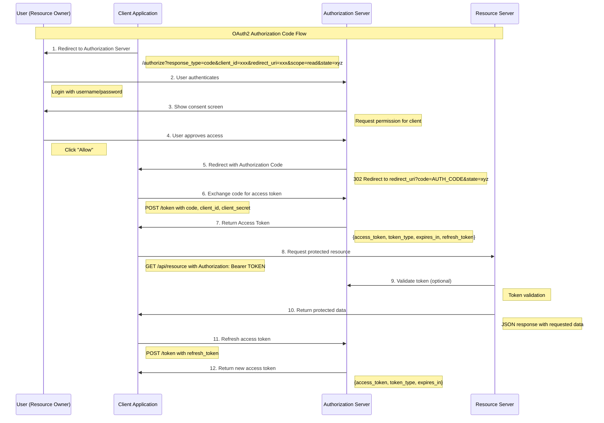

# OAuth2 Authorization Code Flow 时序图

## OAuth2 流程说明

### 参与者
- **User (Resource Owner)**: 资源所有者，通常是最终用户
- **Client Application**: 客户端应用，需要访问用户资源
- **Authorization Server**: 授权服务器，负责认证和授权
- **Resource Server**: 资源服务器，存储受保护的资源

### 主要步骤

1. **授权请求**: 客户端将用户重定向到授权服务器
2. **用户认证**: 用户在授权服务器上进行身份验证
3. **授权同意**: 用户同意客户端访问其资源
4. **授权码返回**: 授权服务器返回授权码给客户端
5. **令牌交换**: 客户端使用授权码换取访问令牌
6. **资源访问**: 客户端使用访问令牌请求受保护资源
7. **令牌刷新**: 访问令牌过期时使用刷新令牌获取新令牌

### 安全特性
- 授权码是临时的，只能使用一次
- 访问令牌有时效性
- 客户端密钥用于验证客户端身份
- State参数防止CSRF攻击

### 使用方法
1. 将此Mermaid代码复制到支持Mermaid的编辑器中
2. 或使用在线Mermaid编辑器: https://mermaid.live
3. 或在GitHub/GitLab的Markdown文件中直接使用
4. 可以导入到Draw.io中进行进一步编辑
